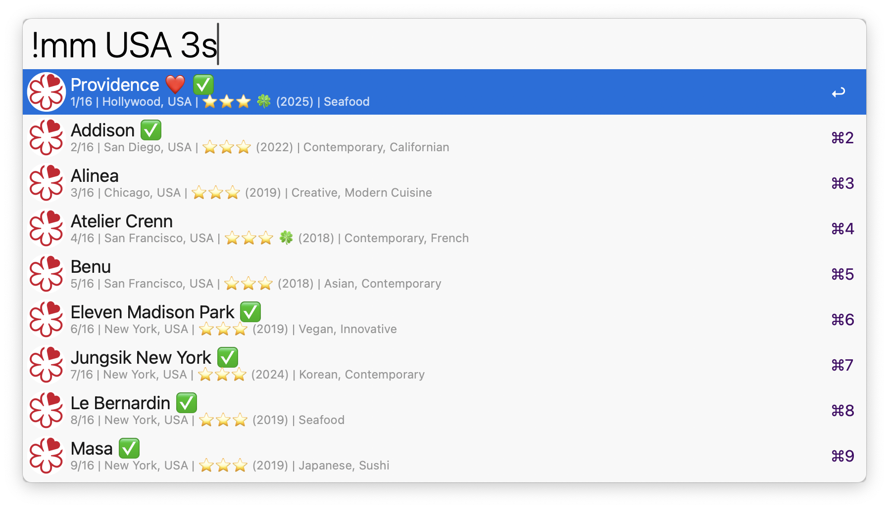

# Michelin Guide ✨️
An Alfred workflow to search, favorite, and track your visits to 20,000+ Michelin guide restaurants around the world.\
Feeling fancy? 🎩 Find your next Michelin-starred restaurant with Alfred. 🌟

<a href="https://github.com/giovannicoppola/alfred-michelin/releases/latest/">
 
</a>

## Features

### 🔍 Smart Search
- **Comprehensive Search**: Search through 20,000+ Michelin guide restaurants by name, location, cuisine, or distinction (stars)
- **Case-Sensitive Search**: When you search with all-caps or partial-caps terms (e.g., "USA", "Italy", "Hill"), the search becomes case-sensitive to avoid false matches
- **Multi-term Search**: Combine multiple search terms (e.g., "USA 3s" finds 3-star restaurants in the USA)
- **Real-time Results**: Instant search results with restaurant details displayed in Alfred

### 📍 Restaurant Information
- **Complete Details**: View restaurant name, address, location, price range, cuisine type, and Michelin distinctions
- **Award History**: Access complete award history for each restaurant (SHIFT modifier)
- **Current Status**: See if restaurants are currently in the guide or have been removed (marked with 📜)
- **Visual Indicators**: Stars displayed as emojis (⭐️⭐️⭐️ for 3-star, etc.) with green star indicators (🍀)

### ❤️ Favorites Management
- **Save Favorites**: Add restaurants to your personal favorites list (CTRL modifier)
- **Quick Access**: View all your favorite restaurants with `!mf` command
- **Search Favorites**: Search within your favorites using `!mf [query]`
- **Visual Indicators**: Heart emoji (❤️) shows favorite status

### ✅ Visit Tracking
- **Track Visits**: Mark restaurants as visited with date and personal notes (ALT modifier)
- **Visit History**: View all visited restaurants with `!mv` command
- **Search Visits**: Search within your visited restaurants using `!mv [query]`
- **Visual Indicators**: Checkmark emoji (✅) shows visited status

### 🌐 External Integration
- **Website Access**: Open restaurant websites directly from Alfred
- **Michelin Guide**: View restaurants on the official Michelin Guide website
- **Maps Integration**: Open restaurant locations in Google Maps or Apple Maps
- **Image Display**: View restaurant images with descriptions (SHIFT modifier)

## Usage

### Primary Commands (default keywords, set your own or hotkeys)
- `!mm [query]` - Search for Michelin restaurants by name, location, cuisine, or distinction
- `!mf` - View all your favorite restaurants
- `!mf [query]` - Search within your favorite restaurants
- `!mv` - View all restaurants you've visited
- `!mv [query]` - Search within your visited restaurants

## Search Examples

### Basic Search
- `!mm "Providence"` - Find specific restaurant
- `!mm "New York"` - Find restaurants in New York
- `!mm "Italian"` - Find Italian cuisine restaurants
- `!mm "3s"` - Find all 3-star restaurants

### Case-Sensitive Search
- `!mm "USA"` - Case-sensitive search for USA (won't match "Da Vittorio" in Italy)
- `!mm "Italy"` - Case-sensitive search for Italy
- `!mm "Hill"` - Case-sensitive search for Hill (won't match "hill" in other words)

### Combined Search
- `!mm "USA 3s"` - Find 3-star restaurants in the USA
- `!mm "Italy 2 star"` - Find 2-star restaurants in Italy
- `!mm "France Michelin"` - Find Michelin restaurants in France

## Once a restaurant is identified: 

- `CTRL`: **❤️Favorite**: Toggle restaurant favorite status
- `ALT`: **✅️Visited**: Toggle restaurant visited status
- `CMD`: **🏆️Awards**: View award history for restaurant (CMD+ALT = back)
- `SHIFT`: **ℹ️More details**

## Installation

1. Download the latest release from the [releases page](https://github.com/giovannicoppola/alfred-michelin/releases/latest)
2. Double-click the `.alfredworkflow` file to install it in Alfred
3. The workflow will automatically set up the database on first use

## Data Source

This workflow uses data from the Michelin Guide [dataset](https://www.kaggle.com/datasets/ngshiheng/michelin-guide-restaurants-2021) and [scripts](https://github.com/ngshiheng/michelin-my-maps/tree/main) generated by [Jerry Ng](https://github.com/ngshiheng) 

## Roadmap 

- Direct database updates via Kaggle Hub
- map visualization? 

## License

MIT

## Changelog

2025-07-13 First release (version 0.1)

## Acknowledgments

- Michelin Guide for restaurant data
- Jerry Ng for the [Michelin My Maps](https://github.com/ngshiheng/michelin-my-maps/tree/main) scripts
- Cursor AI for help with coding and writing this README
- Alfred team for the amazing workflow platform
- Open source community for inspiration and tools
 
