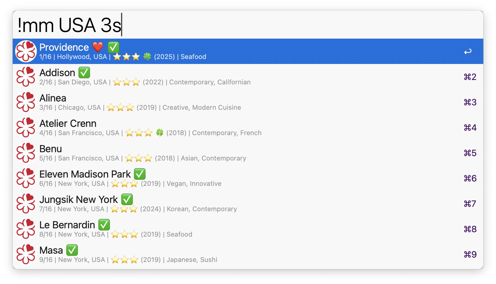

# Michelin Guide ✨️
An Alfred workflow to search, favorite, and track your visits to **23,000+** Michelin guide restaurants around the world, refreshed with the 2026 guide.\
Feeling fancy? 🎩 Find your next Michelin-starred restaurant with Alfred. 🌟

<a href="https://github.com/giovannicoppola/alfred-michelin/releases/latest/">
 
</a>

## Features

### 🔍 Smart Search
- **Comprehensive Search**: Search through 23,000+ Michelin guide restaurants by name, location, cuisine, or distinction (stars)
- **Case-Sensitive Search**: When you search with all-caps or partial-caps terms (e.g., "USA", "Italy", "Hill"), the search becomes case-sensitive to avoid false matches
- **Country & State Filters**: Narrow to a specific country or US state with `country:japan` / `state:ca` — combine with any other filter
- **Multi-term Search**: Combine multiple search terms (e.g., "USA 3s" finds 3-star restaurants in the USA)
- **Real-time Results**: Instant search results with restaurant details displayed in Alfred

### 📍 Restaurant Information
- **Complete Details**: View restaurant name, address, location, price range, cuisine type, and Michelin distinctions
- **Award History**: Access complete award history for each restaurant (SHIFT modifier)
- **Current Status**: See if restaurants are currently in the guide or have been removed (marked with 📜)
- **Visual Indicators**: Stars displayed as emojis (⭐️⭐️⭐️ for 3-star, etc.) with green star indicators (🍀)

### ❤️ Favorites Management
- **Save Favorites**: Add restaurants to your personal favorites list (CTRL modifier)
- **Quick Access**: View all your favorite restaurants with `!mf` command
- **Search Favorites**: Search within your favorites using `!mf [query]`
- **Visual Indicators**: Heart emoji (❤️) shows favorite status

### ✅ Visit Tracking
- **Track Visits**: Mark restaurants as visited with date and personal notes (ALT modifier)
- **Visit History**: View all visited restaurants with `!mv` command
- **Search Visits**: Search within your visited restaurants using `!mv [query]`
- **Visual Indicators**: Checkmark emoji (✅) shows visited status

### 🌐 External Integration
- **Website Access**: Open restaurant websites directly from Alfred
- **Michelin Guide**: View restaurants on the official Michelin Guide website
- **Maps Integration**: Open restaurant locations in Google Maps or Apple Maps
- **Image Display**: View restaurant images with descriptions (SHIFT modifier)

## Usage

### Primary Commands (default keywords, set your own or hotkeys)
- `!mm [query]` - Search for Michelin restaurants by name, location, cuisine, or distinction
- `!mf` - View all your favorite restaurants
- `!mf [query]` - Search within your favorite restaurants
- `!mv` - View all restaurants you've visited
- `!mv [query]` - Search within your visited restaurants

## Search Examples

### Basic Search
- `!mm "Providence"` - Find specific restaurant
- `!mm "New York"` - Find restaurants in New York
- `!mm "Italian"` - Find Italian cuisine restaurants
- `!mm "3s"` - Find all 3-star restaurants

### Case-Sensitive Search
- `!mm "USA"` - Case-sensitive search for USA (won't match "Da Vittorio" in Italy)
- `!mm "Italy"` - Case-sensitive search for Italy
- `!mm "Hill"` - Case-sensitive search for Hill (won't match "hill" in other words)

### Combined Search
- `!mm "USA 3s"` - Find 3-star restaurants in the USA
- `!mm "Italy 2 star"` - Find 2-star restaurants in Italy
- `!mm "France Michelin"` - Find Michelin restaurants in France

### Country and State Filters
- `!mm "country:japan"` - All restaurants in Japan
- `!mm "country:japan 3s"` - 3-star restaurants in Japan
- `!mm "country:united"` - Substring match: hits both United Kingdom and United States
- `!mm "state:ca"` - All restaurants in California (2-letter state code, exact match)
- `!mm "state:ny bg"` - Bib Gourmand restaurants in New York
- `!mm "state:ca sushi"` - Sushi restaurants in California

Filter tokens:

| Token | Meaning |
| --- | --- |
| `1s` / `2s` / `3s` | 1-/2-/3-star restaurants |
| `bg` | Bib Gourmand |
| `sr` | Selected Restaurants |
| `gs` | Green Star recipients |
| `country:<name>` | Country (substring match, case-insensitive) |
| `state:<xx>` | US state (2-letter code, exact match) |

## Once a restaurant is identified: 

- `CTRL`: **❤️Favorite**: Toggle restaurant favorite status
- `ALT`: **✅️Visited**: Toggle restaurant visited status
- `CMD`: **🏆️Awards**: View award history for restaurant (CMD+ALT = back)
- `SHIFT`: **ℹ️More details**

## Installation

1. Download the latest release from the [releases page](https://github.com/giovannicoppola/alfred-michelin/releases/latest)
2. Double-click the `.alfredworkflow` file to install it in Alfred
3. The workflow will automatically set up the database on first use

## Data Source

This workflow uses data from the Michelin Guide [dataset](https://www.kaggle.com/datasets/ngshiheng/michelin-guide-restaurants-2021) and [scripts](https://github.com/ngshiheng/michelin-my-maps/tree/main) generated by [Jerry Ng](https://github.com/ngshiheng) 

## What's new in version 0.2

### 🗓️ Refreshed with the 2026 Michelin guide
- Bundled database now contains **23,517 restaurants** (up from ~21,000) and **76,404 award rows** spanning 2018 – 2026.
- **+6,278 new 2026 award rows** freshly scraped from `guide.michelin.com`.
- Retired restaurants are retained in the DB and shown with the 📜 marker so award history stays queryable.

### 🌍 Country and US-state search
- Every restaurant now carries a normalized `country` (e.g. `France`, `USA`, `Japan`) and, for US restaurants, a 2-letter `us_state` code.
- Coverage: 100% of restaurants have a country; 100% of US restaurants have a state.
- New filter syntax in the main search:
  - `country:japan`, `country:united` (substring match)
  - `state:ca`, `state:ny` (exact 2-letter match)
  - Combine freely with existing filters like `1s`, `bg`, `gs`.

### 🌱 Green Star capture restored
- Michelin's 2026 template rework moved the Green Star signal from a text node to an HTML data attribute, so the previous scraper silently recorded `green_star=0` for every 2026 restaurant. The scraper now reads the new `data-green-star="true"` attribute directly.
- Two-phase targeted rescrape (historical green-star list, then every 2026-award restaurant) recovered **200 restaurants for 2026** and refreshed 526 for 2025 — **588 distinct recipients in total**, including first-time 2026 additions.
- You can filter for them with the existing `gs` token (e.g. `!mm "gs"` or `!mm "gs country:france"`).

### 📊 Built-in markdown report
- Run `./michelin report` to print a full database snapshot to stdout, or `./michelin report path/to/out.md` to write it to a file.
- Includes: totals, in-guide vs. removed, green-star recipients (total and per-year), awards by year, top 20 countries with per-distinction breakdown, top 20 US states, top 20 cuisines, and personal favorites/visits counts.

### 🛠️ Developer: differential scraper
For anyone maintaining a fork, there's now a `scrape-diff` subcommand on the bundled scraper that refreshes a single year by only fetching detail pages for restaurants whose listing-page distinction has actually changed. Unchanged restaurants get a listing-only award row cloned forward, and restaurants that disappear from the listings are flipped to `in_guide=false`. An order of magnitude cheaper than the full scrape for yearly refreshes.

### 🔐 Safer updates
- Per-update timestamped backups (`michelin_backup_<UTC>.db`) instead of a single rolling file, so a mid-update failure doesn't wipe the previous safety net. Only the three most recent backups are kept.
- User favorites and visits are re-mapped by **URL** (stable) instead of autoincrement restaurant ID (not stable across rescrapes), so favorites/visits stay pointed at the right restaurants after every update.
- Removed dead code path that was running a failed update check on every single launch.

## Roadmap

- Direct database updates via Kaggle Hub
- map visualization?

## License

MIT

## Changelog

- **2026-04-23 Version 0.2** – 2026 Michelin data refresh, country / US-state search filters, markdown report generator, differential scraper, Green Star capture restored (200 restaurants recovered for 2026, 588 in-guide total), safer update path.
- **2025-07-13 Version 0.1** – First release.

## Acknowledgments

- Michelin Guide for restaurant data
- Jerry Ng for the [Michelin My Maps](https://github.com/ngshiheng/michelin-my-maps/tree/main) scripts
- Cursor AI for help with coding and writing this README
- Alfred team for the amazing workflow platform
- Open source community for inspiration and tools
 
